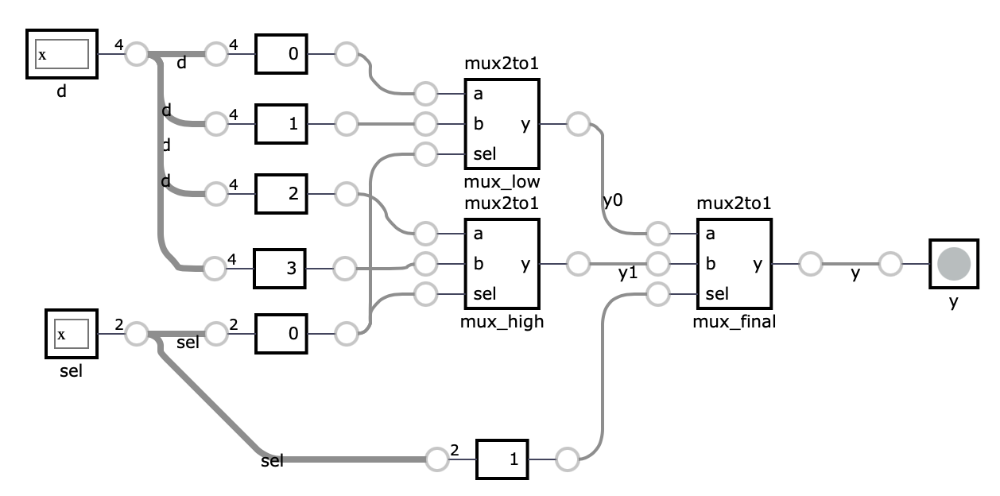
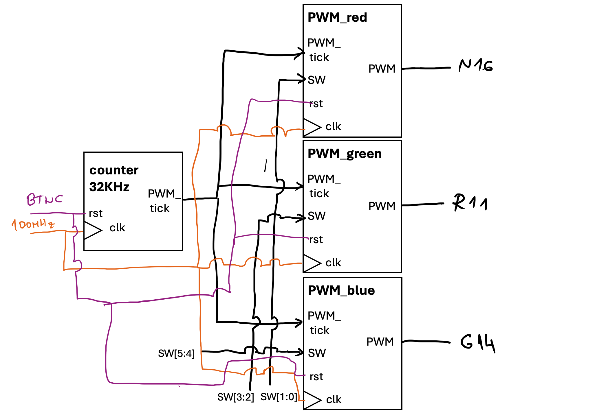
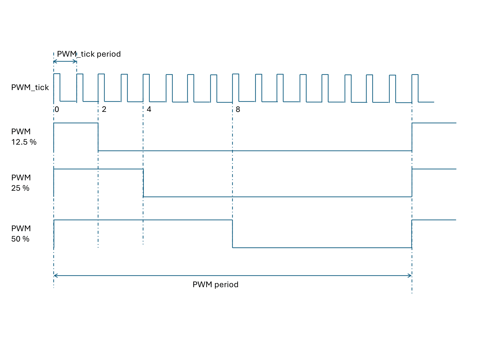

# Fourth exercise: Structural modeling and Simulation

In the previous exercise, we focused on designing counters or flip-flops by describing their functionality in SystemVerilog. This style of modeling is referred to as behavioral modeling. This exercise focuses on structural modeling, where we describe a module in terms of how it is composed of simpler modules. In the example below, we assemble a 4:1 multiplexer from three 2:1 multiplexers. Each copy of the 2:1 multiplexer is called an instance and has a unique name.

```verilog
module mux2to1 (
    input logic a,
    input logic b,
    input logic sel,
    output logic y
);
    assign y = sel ? b : a;
endmodule

module mux4to1 (
    input logic [3:0] d,
    input logic [1:0] sel,
    output logic y
);
    logic y0, y1;

    // instance mux_low of module mux2to1
    mux2to1 mux_low (
        .a(d[0]),
        .b(d[1]),
        .sel(sel[0]),
        .y(y0)
    );

    // instance mux_high of module mux2to1
    mux2to1 mux_high (
        .a(d[2]),
        .b(d[3]),
        .sel(sel[0]),
        .y(y1)
    );

    // instance mux_final of module mux2to1
    mux2to1 mux_final (
        .a(y0),
        .b(y1),
        .sel(sel[1]),
        .y(y)
    );
endmodule
```

As we can see, the instantiation of a module has following syntax: first, we specify the module name, followed by the instance name. In parentheses, we connect the module's inputs and outputs to signals defined at the current level of hierarchy. 

```verilog
// module name - mux2to1
// instance name - mux_final
// parenthesis - we map ports 
//             - .a(y0) - port a of module is connected to signal y0
mux2to1 mux_final (
        .a(y0),
        .b(y1),
        .sel(sel[1]),
        .y(y)
    );
// alternative, more C-like instation
// mux2to1 mux_final(y0,y1,sel[1],y)
```
The bellow image depicts the resulting design: 



## Parametrized components 

So far, all of our modules have had fixed-width inputs and outputs. SystemVerilog allows variable-width modules through the use of parameterized modules. The code below illustrates a parameterized counter module with a variable length output signal.


```verilog
module counter #(
    // Default value if we do ommit 
    // WIDTH parameter while instatiating module
    parameter WIDTH = 8
) (
    input logic clk,
    input logic reset,
    output logic [WIDTH-1:0] count
);
    logic [WIDTH-1:0] count_reg;

    always_ff @(posedge clk) begin
        if (reset) begin
            count_reg <= 0;
        end else begin
            count_reg <= count_reg + 1;
        end
    end

    assign count = count_reg;
endmodule
```
This module defines a counter with a parameterized width. To instatiate in a another module, we need to do following: 

```verilog
module top(
    input logic clk,
    input logic reset,
    input logic [15:0] count);

    // Instantiate the counter with a width of 16
    counter #(
        .WIDTH(16)
    ) counter_inst (
        .clk(clk),
        .reset(reset),
        .count(count)
    );
endmodule
```
To define parameters inside a module, we can use local parameters (`localparam`). Verilog HDL local parameters are identical to parameters except that they cannot be directly modified by `defparam` statements or module instance parameter value assignments. 

```verilog
    ....
    localparam CNT_WIDTH = 16;

    // Instantiate the counter with a width of 16
    counter #(
        .WIDTH(CNT_WIDTH)
    ....
```

## Testbenches 

A testbench is an HDL module used to test another module, known as the device under test (DUT) or unit under test (UUT). The testbench includes statements to apply inputs to the DUT and, ideally, to verify that the correct outputs are generated. The input and expected output patterns are referred to as test vectors.

Let us write the DUT for our 4:1 MUX. Lets fix length to 4-bit.

```verilog
module tb_mux4to1;

    // Testbench signals
    logic [3:0] d;
    logic [1:0] sel;
    logic y;

    // Instantiate the DUT
    mux4to1 dut (
        .d(d),
        .sel(sel),
        .y(y)
    );

    // Test procedure
    initial begin
        // Test case 1
        // Define values for inputs  
        d = 4'b1010; sel = 2'b00;
        // Wait for 10 time units 
        #10;
        // print on STD 
        $display("d=%b sel=%b y=%b", d, sel, y);

        // Test case 2
        d = 4'b1010; sel = 2'b01;
        #10;
        $display("d=%b sel=%b y=%b", d, sel, y);

        // Test case 3
        d = 4'b1010; sel = 2'b10;
        #10;
        $display("d=%b sel=%b y=%b", d, sel, y);

        // Test case 4
        d = 4'b1010; sel = 2'b11;
        #10;
        $display("d=%b sel=%b y=%b", d, sel, y);

        // Finish simulation
        $finish;
    end
endmodule
```

A testbench has no ports of its own. It sits at the top of the simulation hierarchy, so everything it needs (`d`, `sel`, `y`) is declared as a plain `logic` signal inside the module and then wired to the DUT by name, exactly as you would wire a module instance in any other design. `mux4to1` is purely combinational, so the testbench doesn't need to worry about clocking it at all. The `initial` block simply drives a new value onto `d`/`sel`, waits `#10` time units for the change to propagate through the DUT's `assign` statements, and then `$display`s the result. The `#10` delay here isn't required by the circuit, since a combinational output settles essentially instantly. It just gives each test case a clean slice of simulation time so the four `$display` lines don't collide, and makes the resulting waveform easier to read if you open it in GTKWave. Each of the four test cases holds `sel` at all four possible values while `d` stays fixed, letting you check by eye that `y` always equals the bit of `d` selected by `sel`. `$finish` at the end tells the simulator to stop. Without it, a testbench with no more statements to execute would simply hang.

For testing sequential design, we need to account the clock signal. In testbenches we need to create a separate always block that will generate clock signal. Bellow code shows the testbench for our parametrized counter (case for 4-bit).

```verilog
module tb_counter;

    // Testbench signals
    logic clk;
    logic reset;
    logic [3:0] count;

    // Instantiate the DUT
    counter #(
        .WIDTH(4)
    ) dut (
        .clk(clk),
        .reset(reset),
        .count(count)
    );

    // Clock generation
    always begin
        #5 clk = ~clk; // Toggle clock every 5 time units
    end

    // Test procedure
    initial begin
        // Initialize signals
        clk = 0;
        reset = 1;
        // Apply reset
        #10;
        reset = 0;
        // Wait for some time and observe the count
        #100;
        $display("count=%b", count);
        // Finish simulation
        $finish;
    end
endmodule
```

Unlike the MUX testbench, `counter` is a registered design (`always_ff`), so its output only changes on a rising `clk` edge. The testbench has to actually supply that clock, since nothing else in simulation will. That's what the separate `always` block does. With no sensitivity list and no guarding `if`, it just keeps re-executing `#5 clk = ~clk;` for the entire simulation, flipping `clk` every 5 time units and producing a free-running clock with a 10-unit period. This block runs concurrently with the `initial` block below it. In SystemVerilog, every `initial`/`always` block in a module starts at time 0 and proceeds independently, which is exactly why the clock generator has to live in its own block rather than inside the stimulus sequence.

The `initial` block still drives the test, but now in terms of clock edges rather than raw delays. It sets `clk = 0` and `reset = 1` at time 0, holds `reset` high for `#10` (one full clock period) to model a real power-on reset pulse, then deasserts it and waits `#100` (ten clock periods) for the counter to free-run before sampling `count` with `$display`. That wait is the key difference from the combinational case. A combinational output is valid almost immediately after its inputs change, but a register only updates once per clock edge, so a sequential testbench must always budget enough simulated time (or, in more thorough testbenches, wait for a specific number of `@(posedge clk)` events) before checking the DUT's outputs. `$finish` matters more here than in the MUX testbench, because the clock-generation `always` block never terminates on its own. Without an explicit `$finish`, the simulation would run forever.

### Simulating with Anvil / Icarus Verilog

Save the testbench alongside the DUT it exercises. Inside an Anvil project, place it under `tb/` and let `anvil test` drive Icarus Verilog for you:

```bash
anvil test tb/tb_mux4to1.sv     # runs Icarus Verilog, writes tb/tb_mux4to1.vcd
```

You can also invoke Icarus Verilog directly. This is handy while experimenting with standalone snippets like the ones above, outside of a full Anvil project. `iverilog` compiles every file passed on the command line into a single simulation executable, which `vvp` then runs:

```bash
iverilog -g2012 -o sim mux2to1.sv mux4to1.sv tb_mux4to1.sv
vvp sim
```

`-g2012` selects SystemVerilog-2012 syntax, needed for constructs like `logic` and `always_ff` that plain Verilog doesn't have. The `$display` calls in the testbench print straight to the terminal.

To inspect signals over time instead of just the printed values, add a dump block to the testbench:

```verilog
initial begin
    $dumpfile("tb_counter.vcd");
    $dumpvars(0, tb_counter);
end
```

then open the resulting `.vcd` file in GTKWave:

```bash
gtkwave tb_counter.vcd &
```

<!--
## Task: Implement a 4-bit Gray counter

Modify the code from previous exercise, in such a way that design relies on following modules:

| Name       | Generic Parameters | Additional Functionality                  |
|------------|--------------------|-------------------------------------------|
| prescaler  | WIDTH (the width of the counter)           | None           |
| binary_counter | WIDTH  (the width counter)           | Counting frequency: 0.5 Hz and 10 Hz               |
| code_output | WIDTH  (the width output)           |    Selecting if the output is in Gray Code or Binary code     |

--->


## Task: Implement a PWM (Pulse-Width Modulation) module for RGB LED

In this task, you will implement a PWM module for an RGB LED. The module will have three 6-bit inputs, each controlling the duty cycle of the red, green, and blue LEDs. The module will have three 1-bit outputs, each representing the PWM signal for the red, green, and blue LEDs. 

The PWM signal will be generated by comparing the duty cycle with a 4-bit counter that increments with the PWM_tick signal. The PWM_tick signal is generated by a prescaler that outputs a pulse every 3125 clock cycles, corresponding to a frequency of 32 kHz. You will connect the PWM module to the prescaler and the RGB LED module according to the diagram below.



> Note: The N16, R11, and G14 pins on the FPGA board are connected to the red, green, and blue LEDs of the RGB LED, respectively.


Switch values denote duty cycle for each color. The duty cycle is calculated as follows: 

| SW[1:0] | Duty_cycle |
|---------|------------|
| 00      | 0 %        |
| 01      | 12.5 %     |
| 10      | 25 %       |
| 11      | 50 %       |

Duty cycle is definied as ratio of high signal to the period of the signal, e.g. 25% duty cycle means that the signal is high for 25% of the period.

### PWM time diagram


## Implementation guidelines

### Prescaler

The prescaler turns the fast system clock into the slower `pwm_tick` the PWM module counts on. It is a free running counter that produces a single cycle pulse once every `limit` clock cycles. Its interface is already declared in the starter file:

```systemverilog
module prescaler
    #(parameter PRESCALER_WIDTH = 8)
    (
        input logic clk,
        input logic rst,
        input logic [PRESCALER_WIDTH-1:0] limit,
        output logic pwm_tick
    );
```

| Port | Direction | Width | Description |
|---|---|---|---|
| `clk` | input | 1 bit | System clock. The counter advances on its rising edge. |
| `rst` | input | 1 bit | Synchronous reset. Clears the internal counter while high. |
| `limit` | input | `PRESCALER_WIDTH` bits | Number of clock cycles between output pulses. |
| `pwm_tick` | output | 1 bit | Pulses high for one clock cycle, once every `limit` cycles. |

Behavior:

- Keep an internal counter register. On every rising edge of `clk`, if `rst` is high, reset that counter to zero.
- Otherwise, increment the counter by one on every rising edge.
- When the counter reaches `limit - 1`, drive `pwm_tick` high for that clock cycle and let the counter wrap back to zero on the next edge, restarting the count.
- The result is a periodic, single cycle pulse with a period of exactly `limit` clock cycles. With `limit = 3125` and a 100 MHz `clk`, `pwm_tick` fires once every 31.25 microseconds, which is 32 kHz.

### PWM controller

The PWM controller turns a 2-bit duty cycle selection into a single PWM output for one LED color. One instance drives the red LED, one drives green, one drives blue, each fed by its own pair of switches and all three sharing the same `pwm_tick` from the prescaler. Its interface is already declared in the starter file:

```systemverilog
module PWM_controller
(
    input logic clk,
    input logic rst,
    input logic [1:0] SW,
    input logic pwm_tick,
    output logic PWM
);
```

| Port | Direction | Width | Description |
|---|---|---|---|
| `clk` | input | 1 bit | System clock, used to advance the internal counter register. |
| `rst` | input | 1 bit | Synchronous reset. Clears the internal counter while high. |
| `SW` | input | 2 bits | Duty cycle selector for this color, per the duty cycle table above. |
| `pwm_tick` | input | 1 bit | One clock cycle pulse from the prescaler. Acts as a count enable. |
| `PWM` | output | 1 bit | The pulse width modulated signal driving one RGB LED color. |

Behavior:

- Keep an internal 4-bit counter register. Unlike the prescaler, this counter does not advance on every `clk` edge. It advances by one only on a `clk` edge where `pwm_tick` is high, and wraps from 15 back to 0. Sixteen `pwm_tick` pulses therefore make up one full PWM period.
- On a `clk` edge where `rst` is high, reset that counter to zero instead of counting.
- Translate `SW` into a threshold on the same 0 to 15 scale as the counter, so it lines up with the duty cycle table: `00` maps to a threshold of 0, `01` to 2, `10` to 4, and `11` to 8 (0, 2, 4, and 8 sixteenths are 0%, 12.5%, 25%, and 50%).
- Drive `PWM` combinationally from the comparison: high while the counter value is less than the threshold, low otherwise. Since the counter counts through all 16 values once per period, this produces a high pulse whose width, as a fraction of the period, equals the selected duty cycle.

### Top level: rgb_controller

The top module has no logic of its own. It only wires the prescaler and three `PWM_controller` instances together, using structural modeling exactly as introduced at the start of this chapter. Its interface is already declared in the starter file:

```systemverilog
module rgb_controller (
    input logic clock,
    input logic reset,
    input logic [5:0] SW,
    output logic [2:0] RGB
);
```

| Port | Direction | Width | Description |
|---|---|---|---|
| `clock` | input | 1 bit | System clock (100 MHz), forwarded to every instance below. |
| `reset` | input | 1 bit | Synchronous reset, forwarded to every instance below. |
| `SW` | input | 6 bits | Duty cycle selectors, two bits per color: `SW[1:0]` red, `SW[3:2]` green, `SW[5:4]` blue. |
| `RGB` | output | 3 bits | One PWM signal per color: `RGB[0]` red, `RGB[1]` green, `RGB[2]` blue. |

Structure:

- One instance of `prescaler`, driven by `clock`/`reset` and the `limit_value` already wired up in the draft, produces a single `pwm_tick` signal shared by everything downstream.
- Three instances of `PWM_controller`, conventionally named `PWM_red`, `PWM_green`, and `PWM_blue`. These are three separate instances of the exact same module, the same way `mux2to1` was instantiated three times to build `mux4to1` earlier in this chapter, not three different modules. Each instance shares `clock`, `reset`, and the one `pwm_tick` from the prescaler, but connects to a different 2-bit slice of `SW` and drives a different bit of `RGB`. For example, the red instance looks like:

```systemverilog
PWM_controller PWM_red (
    .clk(clock),
    .rst(reset),
    .SW(SW[1:0]),
    .pwm_tick(pwm_tick),
    .PWM(RGB[0])
);
```

`PWM_green` and `PWM_blue` follow the same pattern, connecting `SW[3:2]`/`RGB[1]` and `SW[5:4]`/`RGB[2]` respectively. The draft file's instantiation comments all read "for the red LED". That's a leftover from copy-pasting the first instance, and should read green and blue for the other two.

- Create a testbench to verify the functionality of your PWM module. The testbench is provided in the repository.

### Testbenches for prescaler and PWM_controller

Before wiring everything together, verify `prescaler` and `PWM_controller` on their own, the same way `tb_mux4to1` and `tb_counter` tested individual modules earlier in this chapter. A bug isolated to one small module is far easier to find than the same bug hiding inside the fully assembled `rgb_controller`.

#### tb_prescaler

```systemverilog
module tb_prescaler;

    // Testbench signals
    logic clk;
    logic rst;
    logic [7:0] limit;
    logic pwm_tick;

    // Instantiate the DUT
    prescaler dut (
        .clk(clk),
        .rst(rst),
        .limit(limit),
        .pwm_tick(pwm_tick)
    );

    // Clock generation
    always begin
        #5 clk = ~clk; // Toggle clock every 5 time units
    end

    // Test procedure
    initial begin
        $dumpfile("tb_prescaler.vcd");
        $dumpvars(0, tb_prescaler);

        clk = 0;
        rst = 1;
        limit = 5;
        #10;
        rst = 0;

        // Let the counter run through several periods
        #200;

        $finish;
    end

    // Log every pwm_tick pulse
    always @(posedge clk) begin
        if (pwm_tick)
            $display("t=%0t pwm_tick pulse", $time);
    end

endmodule
```

::: {.callout-note}
Do not test with `limit = 3125`, the value you will eventually use on hardware. At 100 MHz that is a pulse every 31.25 microseconds, so watching even a handful of periods in simulation means sitting through thousands of clock cycles of `$display` output or a huge waveform. Drive `limit` with a small value instead, such as 5 as above, so `pwm_tick` fires every few clock cycles and you can see several full periods and the counter wraparound in a short simulation run. Once the counting and wraparound logic is confirmed correct at a small limit, the same logic is correct at `limit = 3125`, only slower.
:::

#### tb_pwm_controller

`PWM_controller` takes `pwm_tick` as an input rather than generating it, so this testbench stands in for the prescaler with a small free running counter of its own, pulsing `pwm_tick` high for one clock cycle out of every 4, instead of instantiating a full `prescaler` with a large `limit`. The DUT's internal counter then advances once every 4 clock cycles, so a full 16-step PWM period takes 64 clock cycles to simulate, still far shorter than testing against the real `limit = 3125` prescaler.

```systemverilog
module tb_pwm_controller;

    // Testbench signals
    logic clk;
    logic rst;
    logic [1:0] SW;
    logic pwm_tick;
    logic PWM;

    // Instantiate the DUT
    PWM_controller dut (
        .clk(clk),
        .rst(rst),
        .SW(SW),
        .pwm_tick(pwm_tick),
        .PWM(PWM)
    );

    // Clock generation
    always begin
        #5 clk = ~clk; // Toggle clock every 5 time units
    end

    // Stand in for the prescaler: pulse pwm_tick high for one cycle
    // out of every 4 clock cycles
    logic [1:0] tick_count;

    always_ff @(posedge clk) begin
        tick_count <= tick_count + 1;
    end

    assign pwm_tick = (tick_count == 2'd3);

    // Test procedure
    initial begin
        $dumpfile("tb_pwm_controller.vcd");
        $dumpvars(0, tb_pwm_controller);

        clk = 0;
        rst = 1;
        tick_count = 0;
        SW = 2'b00;
        #10;
        rst = 0;

        // Run two full 64-cycle periods (1280 time units) at each duty cycle
        SW = 2'b00; #1280;   // 0 %
        SW = 2'b01; #1280;   // 12.5 %
        SW = 2'b10; #1280;   // 25 %
        SW = 2'b11; #1280;   // 50 %

        $finish;
    end

    // Log every PWM transition, so you can measure how long it stays
    // high relative to the 16-cycle period for each SW value
    always @(PWM) begin
        $display("t=%0t SW=%b PWM=%b", $time, SW, PWM);
    end

endmodule
```

Both testbenches call `$dumpfile`/`$dumpvars` up front, so running them through `anvil test` or `iverilog`/`vvp` produces a `.vcd` file you can open with `gtkwave tb_prescaler.vcd &` or `gtkwave tb_pwm_controller.vcd &`, as described earlier in this chapter. Watching `pwm_tick` and the internal counters directly in the waveform is often faster than reading through `$display` output.

### Pin mapping

Connect the `clock` signal to the system clock (100 MHz), the `reset` signal to the middle button, the six switches `SW[5:0]` to the duty-cycle inputs (two bits per color), and the three `RGB[2:0]` outputs to the RGB LED. Add these to the project's `.xdc` file, following the same `set_property PACKAGE_PIN` / `set_property IOSTANDARD` pattern used in the [tools intro](01-tools-intro.qmd):

```
## Clock signal
set_property PACKAGE_PIN E3 [get_ports {clock}]
set_property IOSTANDARD LVCMOS33 [get_ports {clock}]
create_clock -period 10.0 [get_ports {clock}]

## Switches
set_property PACKAGE_PIN J15 [get_ports {SW[0]}]
set_property IOSTANDARD LVCMOS33 [get_ports {SW[0]}]

set_property PACKAGE_PIN L16 [get_ports {SW[1]}]
set_property IOSTANDARD LVCMOS33 [get_ports {SW[1]}]

set_property PACKAGE_PIN M13 [get_ports {SW[2]}]
set_property IOSTANDARD LVCMOS33 [get_ports {SW[2]}]

set_property PACKAGE_PIN R15 [get_ports {SW[3]}]
set_property IOSTANDARD LVCMOS33 [get_ports {SW[3]}]

set_property PACKAGE_PIN R17 [get_ports {SW[4]}]
set_property IOSTANDARD LVCMOS33 [get_ports {SW[4]}]

set_property PACKAGE_PIN T18 [get_ports {SW[5]}]
set_property IOSTANDARD LVCMOS33 [get_ports {SW[5]}]

## Buttons
set_property PACKAGE_PIN N17 [get_ports {reset}]
set_property IOSTANDARD LVCMOS33 [get_ports {reset}]

## RGB LEDs
set_property PACKAGE_PIN R12 [get_ports {RGB[2]}]
set_property IOSTANDARD LVCMOS33 [get_ports {RGB[2]}]

set_property PACKAGE_PIN M16 [get_ports {RGB[1]}]
set_property IOSTANDARD LVCMOS33 [get_ports {RGB[1]}]

set_property PACKAGE_PIN N15 [get_ports {RGB[0]}]
set_property IOSTANDARD LVCMOS33 [get_ports {RGB[0]}]
```

## Starter files

- [rgb_controller_draft.sv](../code/04_lab/rgb_controller_draft.sv)
- [rgb_controller_tb.sv](../code/04_lab/rgb_controller_tb.sv)
