# Validation of System on Chip (SoC) with measurement tools 

Modern System-on-Chip (SoC) designs integrate multiple digital and mixed-signal components—processors, peripherals, memory, and custom accelerators—onto a single chip. While simulation and formal verification are essential during development, experimental validation using real measurement equipment is a crucial final step to ensure correct functionality under real-world conditions. In this laboratory exercise, an oscilloscope and a signal generator are used to verify the behavior of a Pulse-Width Modulation (PWM) core integrated into the FProV2 SoC.

## Why Use Measurement Equipment for SoC Testing?

Simulation environments operate on idealized models. In contrast, real hardware introduces effects such as:

- clock jitter and skew,

- I/O delays,

- signal integrity issues,

- quantization and timing inaccuracies,

- interaction with external peripherals.    
These factors can lead to discrepancies between simulated and actual behavior. Measurement tools help identify and diagnose such issues, ensuring the SoC meets its specifications in practice.

Using laboratory instruments we can:

- observe actual electrical signals produced by the SoC,
- correlate software configuration with hardware behavior,
- validate timing, frequency, and duty-cycle parameters,
- gain practical experience bridging digital design theory and physical hardware.

## Laboratory Setup

In this lab, we will verify the functionality of a PWM core implemented in the FProV2 SoC using the following equipment:

- **FPGA Development Board**: Hosting the FProV2 SoC with the PWM core.
- **Signal Generator**: Which will provide a reference signal for comparison.
- **Oscilloscope**: To capture and analyze the PWM output signal from the SoC and the reference signal from the signal generator.

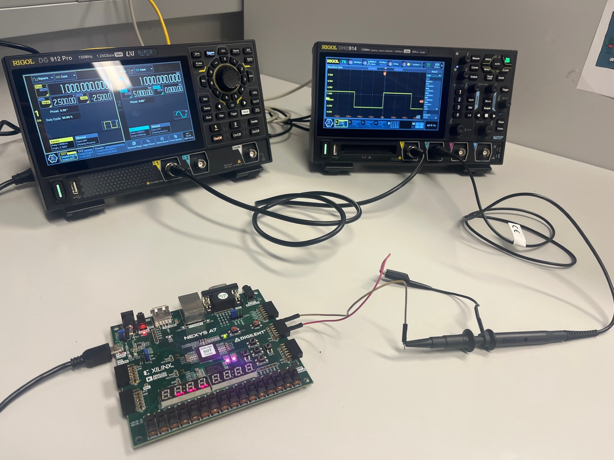

Note: Ensure that osciloscope is first turned on, than the signal generator, and finally the FPGA board to avoid any potential damage to the equipment.

## Signal generator DG912 Pro 

The DG912 Pro is a versatile function generator capable of producing various waveforms, including sine, square, triangle, and arbitrary shapes. In this lab, we will configure the DG912 Pro to generate a square wave signal that serves as a reference for validating the PWM output from the SoC.

When you power on the DG912 Pro, the main screen displays the current waveforms. The DG912 Pro can output signals through two channels (CH1 and CH2). For this lab, we will use CH1.

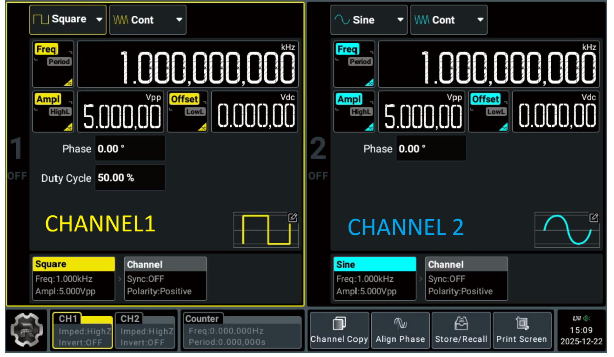

## Configuring the Signal Generator

For every channel you can set:
- Waveform type (sine, square, triangle, etc.), 
    - Marked with red box in the image bellow.
    - Besides square wave, you can also select other waveforms like sine, triangle, ramp, pulse, noise, DC, and arbitrary waveforms.
- Frequency,
  - Marked with green box in the image bellow.
  - You can set the frequency by pressing the "FREQ" button and using the numeric keypad on menu to enter the desired value. Confirm your input by pressing the "ENTER" button. 
- Amplitude,
  - Marked with blue box in the image bellow.
  - You can set the amplitude by setting the "VPP" (peak-to-peak voltage) value using the numeric keypad on menu and confirming with the "ENTER" button.
    - VPP (peak-to-peak voltage) is the difference between the maximum and minimum voltage levels of the waveform. 
  - Besides VPP, you can also set Offset voltage (DC offset) using the "OFFSET" button. Offset of OV means that the waveform is centered around 0V -> the maximum voltage will be +VPP/2 and the minimum voltage will be -VPP/2.
  - If you want to set the amplitude using high and low voltage levels instead of VPP and Offset, you can press the Ampl/HighL button to toggle between these two modes.

- Phase & Duty cycle (for square waves),
  - Marked with purple box in the image bellow.
  - You can set the duty cycle by pressing the "DUTY" button and using the numeric keypad on menu to enter the desired percentage value (0-100%). Confirm your input by pressing the "ENTER" button. 
    - Duty cycle is the percentage of one period in which a signal is active (high). For example, a 50% duty cycle means the signal is high for half of the period and low for the other half. 
  - Phase measures the shift of the waveform relative to a reference point in time. You can set the phase by pressing the "PHASE" button and using the numeric keypad on menu to enter the desired value in degrees (0-360°). Confirm your input by pressing the "ENTER" button.

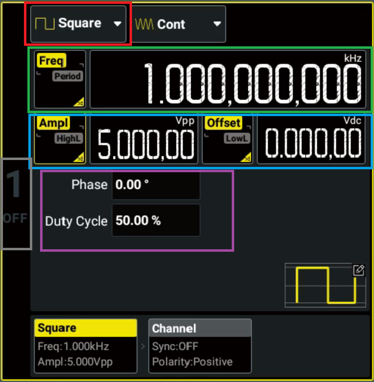

When you finish configuring the signal generator, make sure to enable the output by pressing the the gray area. The area should light up with yellow, indicating that the output is active.

## Using the Oscilloscope Rigol DHO914 to observe Signals

The Rigol DHO914 is a digital oscilloscope that allows you to visualize and analyze electrical signals in real-time. In this lab, we will use the oscilloscope to capture and compare the PWM output signal from the FProV2 SoC with the reference signal generated by the DG912 Pro signal generator.

### Connecting the Signals to the Oscilloscope

1. Connect the reference signal output from the signal generator (Channel 1) to Channel 2 (CH2) of the oscilloscope using a BNC cable.
2. Connect the PWM output pin from the FPGA development board to Channel 1 (CH1) of the oscilloscope using a BNC probe.

### Configuring the osciloscope

When you power on the oscilloscope, the main screen displays the waveforms captured on each channel. The Rigol DHO914 has multiple channels (CH1, CH2, etc.) that can be used to display different signals simultaneously.

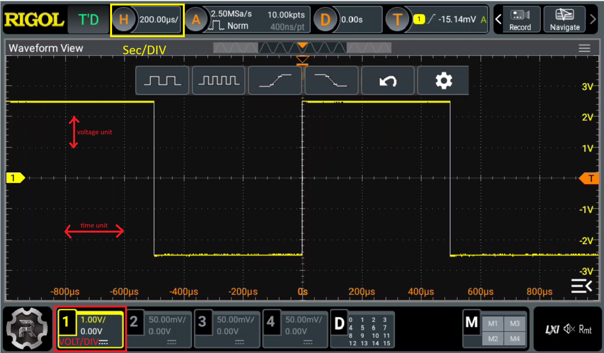

If you look bellow, the yellow box is active, meaning that CH1 is currently selected (next to the RIGOL logo, in the lower left corner). You can switch between channels by pressing the corresponding channel button on the front panel of the oscilloscope. Each channel has its own set of controls for adjusting settings such as vertical scale, coupling, and position.

The waveform display is divided into a grid, which helps you measure time and voltage levels. The horizontal axis represents time, while the vertical axis represents voltage. To adjust the time scale, use the "Sec" knob located on the front panel (image bellow). To adjust the voltage scale for each channel, use the "Volts/DIV" knob corresponding to that channel (image bellow). These knobs allow you to zoom in or out on the waveform for better visibility. In the image above, the SEC/DIV is set to 200 µs/div, meaning that each horizontal division represents 200 microseconds. The VOLTS/DIV for CH1 is set to 1 V/div, meaning that each vertical division represents 1 volts.

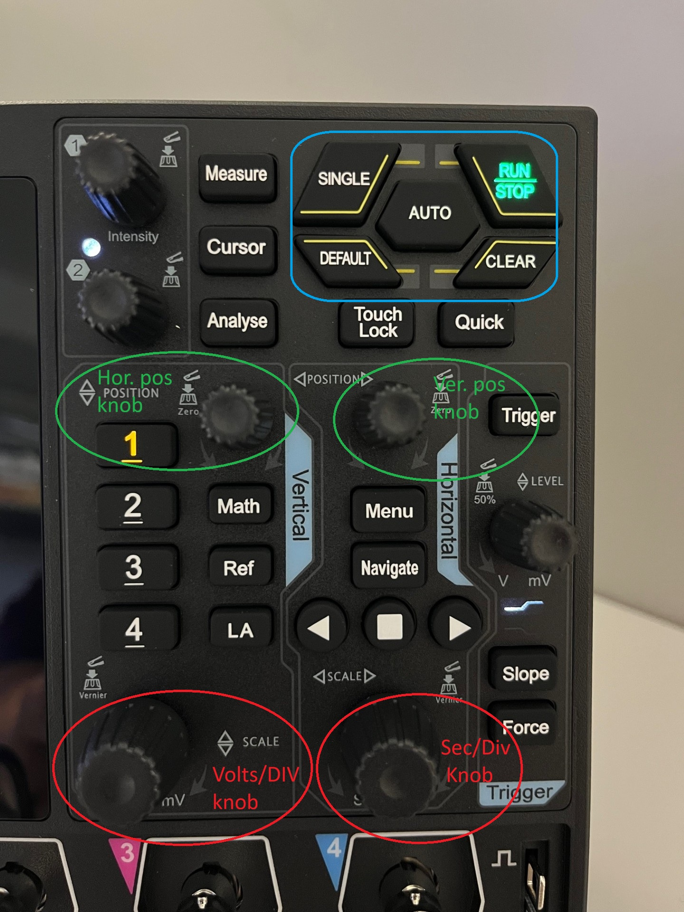

The image above shows the front panel controls for adjusting the time and voltage scales. The "Sec/DIV" knob allows you to change the time scale, while the "Volts/DIV" knobs for each channel allow you to change the voltage scale (marked with red circles). Moreover, you can adjust the position of the waveform vertically and horizontally using the "Position" knobs for each channel and the "Horizontal Position" knob, respectively (marked with red circles in the image above). This allows you to center the waveform on the screen for better analysis. Finally, you can use the "Auto" button to automatically adjust the settings for optimal waveform display. This feature is particularly useful when you are unsure of the signal characteristics. You can also manually stop the waveform acquisition by pressing the "Run/Stop" button. On the next click, the oscilloscope will resume capturing waveforms.

### Measuring Signal Parameters

The Rigol DHO914 oscilloscope provides various measurement tools to analyze signal parameters such as frequency, period, duty cycle, rise time, and fall time. To access the measurement menu, press the "Measure" button on the waveform display (image bellow) or Measure knob on the front panel. (left from AUTO button)

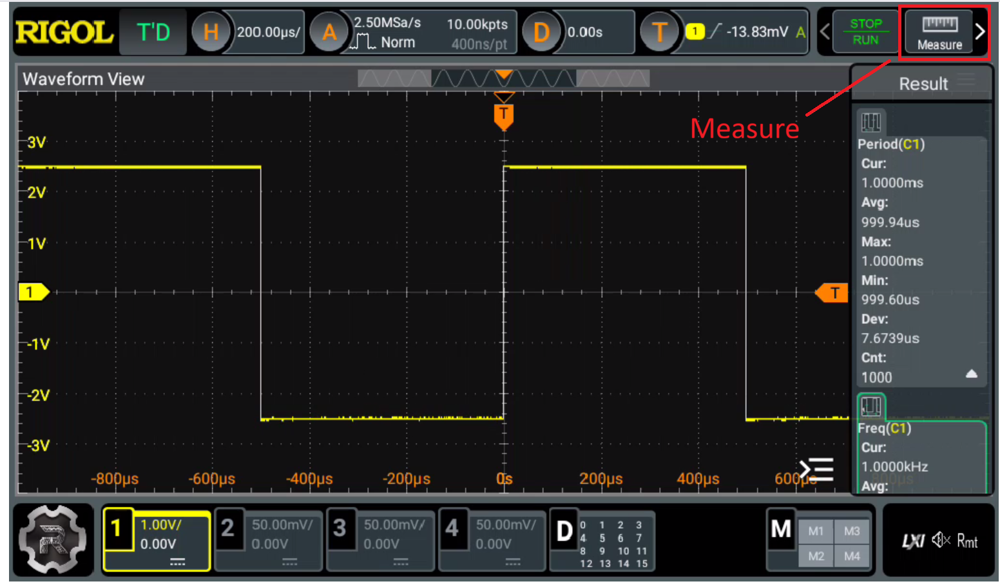

The measurement menu allows you to select different parameters to measure. You can add multiple measurements by selecting the desired parameter from the list. All the measurements are grouped in three categories: 
- Vertical, which represents voltage-related measurements (e.g., Vmax, Vmin, Vavg, Vpp, Vrms),
- Time, which represents time-related measurements (e.g., Frequency, Period, Rise Time, Fall Time, Duty Cycle),
- Other, which allows which allows you to measure delay, phase etc. 

For example, you can measure the period (Period),  frequency (Freq) and duty cycle (+Duty) of the PWM signal simultaneously. Once you have selected the measurements, they will be displayed on the waveform display, allowing you to analyze the signal characteristics in real-time.

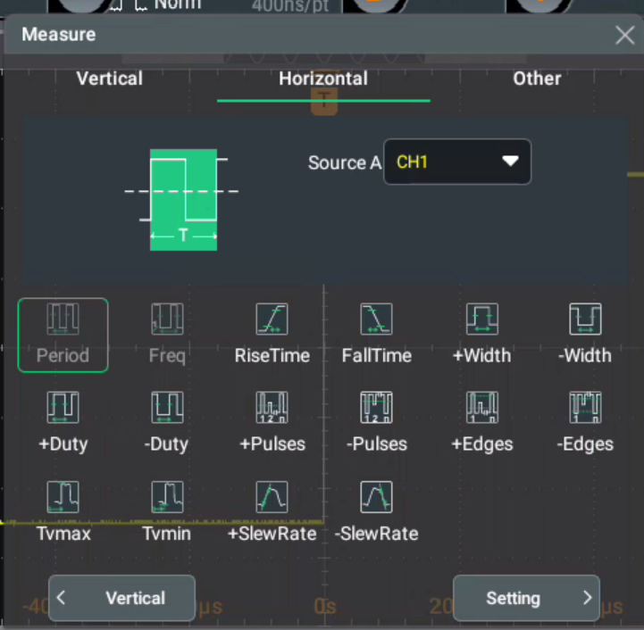

After selecting the measurements, you can exit the measurement by closing the measurement menu. The selected measurements will be displayed on the right side of the waveform display (image bellow). You can monitor these values in real-time as the oscilloscope captures the waveforms.

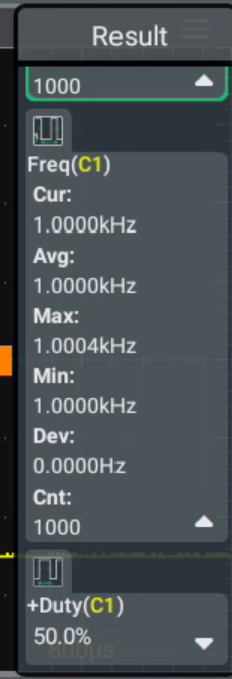

## PWM IP core for FProV2 SoC

The PWM (Pulse-Width Modulation) core is a digital module that generates a PWM signal based on the configuration parameters provided by the user. The PWM signal is characterized by its frequency and duty cycle, which can be adjusted to control the power delivered to a load, such as a motor or LED.

In this lab, we will use the PWM core integrated into the FProV2 SoC. The PWM core can be configured through memory-mapped registers, allowing the user to set the desired frequency and duty cycle of the PWM signal.

### PWM Core Registers

The PWM core has the following memory-mapped registers:
- **PWM Control Register (0x00)**: This register is used to enable or disable the PWM core. Writing a value of 1 to this register enables the PWM output, while writing a value of 0 disables it.
- **PWM Frequency Register (0x04)**: This register is used to set the frequency of the PWM signal. The value written to this register determines the period of the PWM waveform.
- **PWM Duty Cycle Register (0x08)**: This register is used to set the duty cycle of the PWM signal. The value written to this register determines the percentage of time the PWM signal is high during one period.

### Configuring the PWM Core

To configure the PWM core, follow these steps:
1. Enable the PWM core by writing a value of 1 to the PWM Control Register (0x00).
1. Write the desired frequency value to the PWM Frequency Register (0x04).
2. Write the desired duty cycle value to the PWM Duty Cycle Register (0x08).

### Connecting the PWM Output to the FPGA board

Unlike previous labs, we will connect the PWM output to the JA PMOD header of the FPGA board. The PWM output pin is connected to JA1 pin 1 (PWM_OUT). Make sure to connect the ground (GND) of the FPGA board to the ground of the oscilloscope to ensure a common reference point for accurate measurements.

The JA PMOD header pinout is as follows:
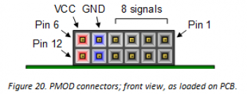

#### Connecting the Oscilloscope Probes

- Connect the ground clip of the oscilloscope probe to the GND pin (pin 5) of the JA PMOD header.
- Connect the probe tip to the PWM output pin (pin 1) of the JA PMOD header.

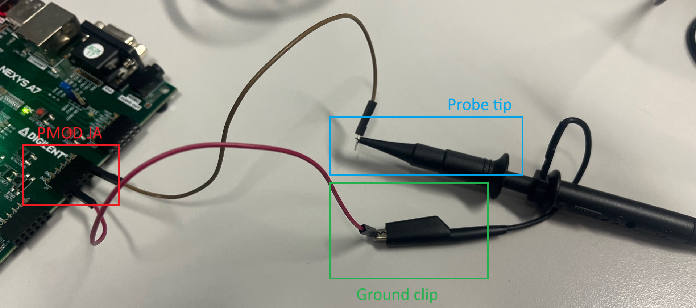

Please ensure that probe tip does not have amplification (set to 1X) to avoid signal distortion.

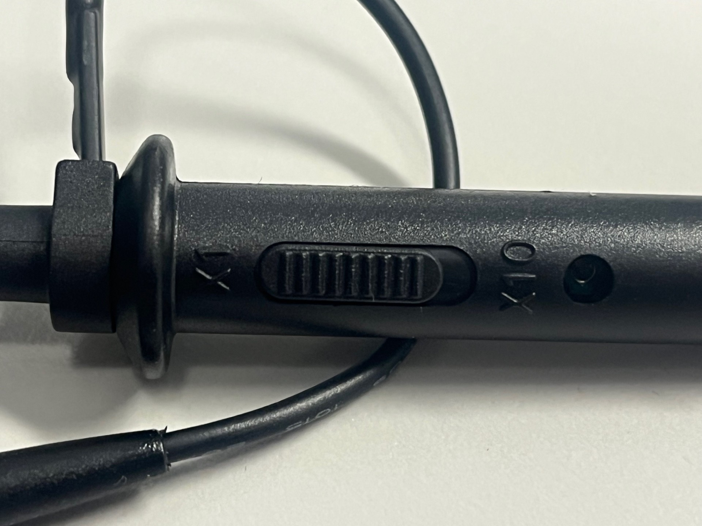

## Exercise 

In the repository, you will find the implementation of the PWM core and a simple test program to configure and test the PWM functionality. Your task is to modify the test program to configure the PWM core with different frequency and duty cycle values, and then use the oscilloscope to verify that the PWM output matches the expected parameters. Compare the generated signal with the reference signal from the signal generator.

- Set the signal generator to output a square wave with a frequency of 1 kHz and a duty cycle of 50%. Configure the PWM core to match these parameters and verify the output using the oscilloscope.
  - The high level voltage of the signal generator should be set to 3.3V to match the FPGA output voltage levels. (VPP = 3.3V, Offset = 1.65V)
- Next, change the duty cycle of the PWM core to 75% while keeping the frequency at 1 kHz. Verify the output signal on the oscilloscope and compare it with the reference signal from the signal generator.
- Finally, change the frequency of the PWM core to 500 Hz with a duty cycle of 25%. Again, verify the output signal on the oscilloscope and compare it with the reference signal from the signal generator.

> Note: For every configuration change, make sure to adjust the oscilloscope settings (time scale and voltage scale) accordingly to properly visualize the PWM signal.
> Note: to change frequency and duty cycle values in the test program, you will need to modify the corresponding register write operations in the code. After you compile the code, rerun write bistream operation and download the new bitstream to the FPGA board.

## Starter files

- [APB_pwm.sv](../code/09_lab/APB_pwm.sv)
- [main.c](../code/09_lab/main.c)
